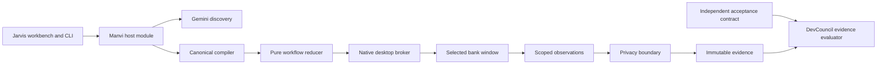

# Jarvis

Jarvis discovers desktop capabilities with Gemini, freezes them into typed artifacts, and executes those artifacts through Manvi with zero model decisions. DevCouncil evaluates an independent acceptance contract against the resulting evidence. The native bank has two tenant layouts; the native workbench exposes catalog, editing, execution, approvals, takeover, diagnostics, and evidence inspection.

This checkout is under active qualification. The macOS readiness campaign in `evidence/macos-stability-readiness.json` passed **20/20 North and 20/20 South** live balance replays, with independent evidence checks and unchanged saved bank state. Every run needed observation retries; first-attempt successes were zero. Both tenants also exercised actual approval denial safely. Reports bind exact tested executable hashes; later visual-anchor and discovery-journal changes still require a consolidated build and rerun. The original failing campaigns remain available. Live Gemini and human-approved account changes remain unqualified; Windows runtime qualification is deferred by the user, and Linux guest qualification is underway.

## Ownership



Manvi owns the workflow/compiler/catalog, native broker/client, provider integration, journal privacy, cancellation and per-attempt budget ledger. DevCouncil owns evidence validation and acceptance predicates. Jarvis owns bank/workbench composition, reviewed tenant profiles, independent scenario expectations, qualification and packaging. Generic components are developed in their upstream worktrees, not copied here.

## Build and run

Prerequisites: Rust and Cargo with the target platform toolchain, Go 1.26.6, platform accessibility and capture permissions, and the pinned Manvi/DevCouncil checkouts. `cmd/dev` uses Go/Rust only. Platform-specific prerequisites are in `docs/platforms.md`.

```sh
go run ./cmd/dev workspace --manvi /path/to/Manvi --devcouncil /path/to/DevCouncil
go run ./cmd/dev build --manvi /path/to/Manvi --devcouncil /path/to/DevCouncil
./build/jarvis doctor
./build/jarvis-workbench --backend ./build/jarvis --root .
```

The generated local `go.work` is ignored. Build outputs are under `build/`. The Go host builds with `CGO_ENABLED=0`; platform FFI is confined to Manvi's Rust native adapters. Qualification builds disable egui inspection controls. Do not treat a Rust cross-check as proof of native execution on that OS.

```sh
./build/jarvis compile --capability examples/balance.json --register
./build/jarvis replay --capability examples/balance.json --tenant north
./build/jarvis replay --capability examples/balance.json --tenant south
./build/jarvis codegen --capability examples/balance.json --out examples/generated/balance/capability.go
go run ./cmd/qualify --n 20 --out evidence/macos-stability.json
```

The default typed input is the synthetic member M-1001. Use `--inputs scenarios/m1002.inputs.json --contract scenarios/balance-m1002.contract.json` for the second independent expectation. `--pid` attaches an existing bank process; absent `--pid`, Jarvis starts and owns a new bank process. Each interactive desktop has one input owner, including cooperating broker processes.

Account-changing replay:

```sh
./build/jarvis replay --capability examples/create-subaccount.json --inputs scenarios/subaccount.inputs.json --contract scenarios/subaccount.contract.json
```

The workflow pauses for a human approval of the exact action, revision, input binding and observed form. In the CLI, type `approve` or `deny`; the workbench provides the corresponding reviewed action controls. Approval is consumed once. After uncertain delivery the engine fences input, attempts one bounded same-session observation, and retains `outcome_unknown`. The reconciliation report records observed UI facts without asserting a durable account change. Automatic mutation retry and terminal-run resume remain prohibited.

## Discovery and assisted mode

Enter a Gemini credential in the workbench, or set `GEMINI_API_KEY` in the process environment yourself. Do not put credentials in capabilities, repository configuration or command arguments. Workbench credentials remain in memory. `discover` registers only scoped desktop observation, typed steps, and capability publication; the model receives no shell, filesystem, oracle, or unrelated network tools.

```sh
./build/jarvis discover --tenant north --task 'Look up the member balance, extract USD money, and publish bank.balance.'
./build/jarvis discover --tenant north --resume-session .local/discovery/RUN_ID/session.json --task 'Continue from a fresh scoped observation.'
```

The initial model is `gemini-3.8-flash`, prompt revision `jarvis-desktop-v1`. A durable $25 campaign ledger reserves the maximum configured input/output charge before every actual HTTP attempt, including transport retries. Unknown/rejected attempts retain reservations; validated usage settles the successful attempt. The conservative rates are $1.50/M input and $7.50/M output including thinking, above the September 2026 promotional rates. This governs this campaign's admission, not unrelated account spending. [Google pricing](https://ai.google.dev/gemini-api/docs/pricing)

Enable `--assisted` or the workbench checkbox for one explicitly requested safe model recovery while paused. The only recovery choices are a unique enabled Back or Dismiss button. Recovery stays paused, records actor `model_recovery`, and requires canonical checkpoint resume. Matching scores never grant approval.

## Evidence and offline replay

Run bundles live in `evidence/private/RUN_ID/`: exact capability and contract bytes, tenant binding, sanitized screenshots and accessibility trees, action/event journal, deterministic trace, Perfetto-compatible trace and the independent verification report. The workbench exports an explicit completed run as a ZIP. Provider-private signed continuation is kept separately under `.local/discovery/`; public journals remove opaque continuation and signatures.

Discovery uses the same durable desktop journal and frame writer as replay. Its `desktop-artifacts.json` hashes the journal and retained frames and explicitly says `not_evaluated`; discovering a proposed capability does not satisfy an independent acceptance contract. An unsuccessful executed discovery step cancels the outer model loop. Run history and program generations keep controls bound to the selected invocation even when discovery advances between microprograms.

The structured editor edits parameters, targets, ordered steps, references and limits through the canonical compiler. Bounded visual anchors can be cropped from the current trusted masked frame for controls without accessibility semantics. Their templates are immutable inline PNGs; protected search regions, ambiguous matches and changed frame geometry are refused. Every visual click requires fresh approval, and visual matches cannot supply extracted text.

```sh
./build/jarvis trace replay --capability evidence/private/RUN_ID/capability.json --trace evidence/private/RUN_ID/trace.json
./build/jarvis verify --contract CONTRACT --bundle BUNDLE --contract-sha256 EXPECTED_CONTRACT_HASH --capability-sha256 EXPECTED_CAPABILITY_HASH --run-id EXPECTED_RUN --session-id EXPECTED_SESSION --epoch 1
```

`trace replay` uses the exported pure workflow reducer and has no desktop backend. `verify` requires independent expected identities; it does not read a runner's `passed` flag. Missing prerequisites produce `incomplete`. Hashes identify exact bytes and detect inconsistency, not truthful observation by an untrusted coordinator. A separate qualification-only oracle checks saved bank state and is unavailable to discovery.

## Validation

```sh
go run ./cmd/dev test --manvi /path/to/Manvi --devcouncil /path/to/DevCouncil
DEVC_COUNCIL_EVIDENCE_ROOT=/path/to/DevCouncil go test github.com/bharathvbcr/Manvi/manvi/devcouncil -run TestEvidenceRustCompatibility -count=1
go run ./cmd/qualify --check-boundaries
```

Read-only qualification never approves a business change. The denial scenario records denied approval and checks that saved state stayed unchanged. Successful account-changing qualification requires real human approval on every OS/tenant combination. All-success 20/20 results have an approximately 86.1% one-sided 95% exact-binomial lower bound under independence; repeated desktop runs are regression evidence, not proof of independent reliability. [Exact-binomial method](https://itl.nist.gov/div898/software/dataplot/refman2/auxillar/exacbino.htm)

See `REPORT.md` for the required assignment narrative and `docs/requirements-evidence.md` for the acceptance matrix.
