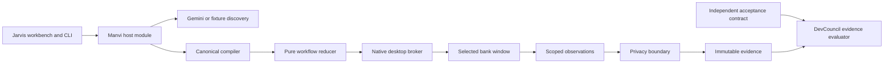

# Jarvis

Jarvis discovers desktop capabilities with Gemini, freezes them into typed Manvi artifacts, replays those artifacts with zero model decisions, and asks DevCouncil to evaluate an independent acceptance contract. The native bank has two tenant layouts (North / South); the workbench exposes catalog, editing, execution, approvals, takeover, diagnostics, and evidence inspection.

This repository is public and buildable against pinned upstream commits. It does **not** claim a live Gemini discovery bundle or newly re-recorded Phase-6 macOS campaign bundles until those runs complete on a machine with Screen Recording granted and `GEMINI_API_KEY` set.

Pinned upstream (see `upstream.lock.json`):

| Upstream | Revision |
|---|---|
| [Manvi](https://github.com/bharathvbcr/Manvi) | `adeb253a76f20c279b820f63cc340743bec25ef2` |
| [DevCouncil](https://github.com/bharathvbcr/DevCouncil) | `5818ac55e51ef4209d305758fa9034ceb99faee5` |

## Ownership



Manvi owns workflow/compiler/catalog, native broker, provider integration, journal privacy, and budget ledger. DevCouncil owns evidence validation. Jarvis owns bank/workbench composition, `policies/*.json`, profiles, overlays, scenarios, and packaging.

## Setup

Prerequisites: Go 1.26.6, Rust/Cargo for the host platform, Accessibility permission, and (for live capture) **Screen Recording** granted to Terminal / Cursor and `build/manvi-desktop`. Platform notes: `docs/platforms.md`.

### Reviewer build from pins (no local replaces)

```sh
git clone https://github.com/bharathvbcr/Jarvis.git
cd Jarvis
# Optional: clone pinned upstreams beside the repo, or let bootstrap fetch them
go run ./cmd/dev bootstrap \
  --manvi ../Manvi \
  --devcouncil ../DevCouncil
go run ./cmd/dev check-pins --manvi ../Manvi --devcouncil ../DevCouncil
go run ./cmd/dev build --manvi ../Manvi --devcouncil ../DevCouncil
./build/jarvis doctor
```

`go.mod` requires Manvi at the pinned commit. A generated local `go.work` (gitignored) may replace Manvi for day-to-day hacking; reviewers should build with `GOWORK=off` or without a `go.work` so the module pin is what resolves.

```sh
GOWORK=off go build -trimpath -o build/jarvis ./cmd/jarvis
```

### Keys and credentials

- Live discovery: set `GEMINI_API_KEY` in the process environment, or enter a credential in the workbench memory field.
- Do **not** put credentials in capabilities, repository files, command arguments, or chat logs.
- Fixture discovery needs **no** API key.
- DevCouncil task verification that calls OpenRouter critics needs that provider configured separately; absence of OpenRouter does not block offline Go/Rust tests.

### Offline / fixture mode

| Mode | Command surface | Network | Evidence class |
|---|---|---|---|
| Fixture discovery | `discover --provider fixture` | none | `not live` |
| Offline trace replay | `trace replay` | none | reconstructs reducer state |
| Independent verify | `verify` / `dcverify evidence-check` | none | contract vs bundle bytes |
| Live Gemini discovery | `discover --provider gemini` | Gemini | `live` (after you run it) |
| Live bank replay | `replay` | none (local UI) | needs Screen Recording |

Default fixture transcript: `internal/app/testdata/discovery/balance-tool-transcript.json` (override with `--fixture PATH`).

## Demo commands

Build once:

```sh
go run ./cmd/dev build --manvi /path/to/Manvi --devcouncil /path/to/DevCouncil
./build/jarvis doctor
```

### Fixture discovery (no API key; not live)

```sh
./build/jarvis discover --provider fixture --tenant north \
  --task 'Observe the bank, find the member using the member_id parameter reference, search, extract Balance as USD money, declare outcomes/outputs/ladder, and publish bank.balance at revision 1.'
```

### Drift (read-only ladder resolve)

```sh
./build/jarvis drift --capability examples/balance.json --tenant north
./build/jarvis drift --capability examples/balance.json --tenant south
```

South with renamed controls needs the overlay profile bind; without Screen Recording the broker still reports `capture_permission` and drift cannot complete live resolve.

### Compile, register, unattended gate

```sh
./build/jarvis compile --capability examples/balance.json --register
./build/jarvis catalog
# Unattended refuses draft/revoked/missing catalog approval:
./build/jarvis replay --unattended --capability examples/balance.json \
  --contract scenarios/balance-m1001.contract.json \
  --inputs scenarios/m1001.inputs.json --tenant north
```

Approve the catalog entry via the workbench (`jarvis.catalog.promote` / catalog Approve APIs) before `--unattended` succeeds.

### Scenario matrix (live replay; needs Screen Recording)

Grant Screen Recording to the native helper, then:

```sh
# success
./build/jarvis replay --capability examples/balance.json \
  --contract scenarios/balance-m1001.contract.json \
  --inputs scenarios/m1001.inputs.json --tenant north

# not_found
./build/jarvis replay --capability examples/balance.json \
  --contract scenarios/balance-m9999.contract.json \
  --inputs scenarios/m9999.inputs.json --tenant north

# permission_denied
./build/jarvis replay --capability examples/balance.json \
  --contract scenarios/balance-permission-denied.contract.json \
  --inputs scenarios/m1001.inputs.json --tenant north --fault permission-denied

# declared overlay recovery
./build/jarvis replay --capability examples/balance.json \
  --contract scenarios/balance-overlay.contract.json \
  --inputs scenarios/m1001.inputs.json --tenant north --fault overlay

# south tenant overlay (renamed Search → Find member)
./build/jarvis replay --capability examples/balance.json \
  --contract scenarios/balance-south-overlay.contract.json \
  --inputs scenarios/m1001.inputs.json --tenant south --variant renamed-controls

# hard failure
./build/jarvis replay --capability examples/create-subaccount.json \
  --contract scenarios/missing-control.contract.json \
  --inputs scenarios/subaccount.inputs.json --tenant north --fault missing-control

# session-expired handoff — when paused, type:
#   takeover
#   act set_value Passcode BRANCH-7741
#   act press Continue
#   handback
# then approve when prompted
./build/jarvis replay --capability examples/create-subaccount.json \
  --contract scenarios/subaccount-session-expired.contract.json \
  --inputs scenarios/subaccount.inputs.json --tenant north --fault session-expired
```

Account-changing create (approval required):

```sh
./build/jarvis replay --capability examples/create-subaccount.json \
  --inputs scenarios/subaccount.inputs.json \
  --contract scenarios/subaccount.contract.json
```

### Offline evidence checks

```sh
./build/jarvis trace replay \
  --capability evidence/examples/macos-balance/capability.json \
  --trace evidence/examples/macos-balance/trace.json

go run ./cmd/dev test --manvi /path/to/Manvi --devcouncil /path/to/DevCouncil
```

### Live Gemini discovery (your machine)

Follow `docs/live-discovery-runbook.md`. Short form:

```sh
export GEMINI_API_KEY=...   # in your shell only
./build/jarvis discover --provider gemini --tenant north \
  --task 'Observe the bank, find the member using the member_id parameter reference, search, extract Balance as USD money, declare outcomes outputs and ladder rationale, and publish bank.balance at revision 1.'
```

Sanitized public copy belongs under `evidence/discovery/<RUN_ID>/`. Private journals stay in `.local/discovery/` (gitignored).

## Evidence honesty

- Historical curated bundles under `evidence/examples/macos-*` are real macOS runs from earlier revisions (pre-outcome-field shape). Keep them; do not treat them as Phase-6 re-records.
- Phase-6 contracts and bank faults are in-tree; live re-record was blocked when Screen Recording was not granted to `manvi-desktop`.
- No live Gemini discovery artifact is published in this tree yet.
- See `evidence/README.md`, `REPORT.md`, and `docs/requirements-evidence.md`.

## Workbench

```sh
./build/jarvis-workbench --backend ./build/jarvis --root .
```
