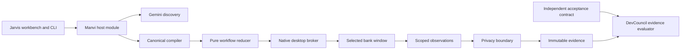

# Jarvis

[](https://jarvis.vbcr.dev/)

Jarvis discovers desktop capabilities with Gemini, freezes them into typed artifacts, and executes those artifacts through Manvi with zero model decisions. DevCouncil evaluates an independent acceptance contract against the resulting evidence. The native bank has two tenant layouts; the native workbench exposes catalog, editing, execution, approvals, takeover, diagnostics, and evidence inspection.

The pinned build passes its automated suites. Its fresh macOS campaign completed
**23/40 read-only replays**, with **17 safe suspensions after input-counter changes**;
all 40 independent saved-state checks passed. Those suspensions were attributed to
bare pointer motion by a [controlled experiment](evidence/guard-partition/) and the
admission guard was narrowed to the input that can actually commit a change. The
campaign that followed completed **35/40**, again with all 40 saved-state checks
unchanged, and its four remaining refusals are attributed by input category — all
genuine human keyboard and pointer-button activity during the run, none of it
pointer motion. Neither is a clean stability pass.
Earlier macOS and Linux X11 campaigns each passed 20/20 per tenant on their recorded
executables. First-attempt successes were zero on macOS and one on Linux; retries
are reported separately. The Linux refresh is blocked by a UTM startup crash.
Live Gemini and human-approved account changes remain unqualified; Windows
runtime qualification is deferred by the user. See the exact results in
[`evidence/`](evidence/README.md) and the remaining [acceptance gates](docs/requirements-evidence.md).

## Ownership



Manvi owns the workflow/compiler/catalog, native broker/client, provider integration, journal privacy, cancellation and per-attempt budget ledger. DevCouncil owns evidence validation and acceptance predicates. Jarvis owns bank/workbench composition, reviewed tenant profiles, independent scenario expectations, qualification and packaging. Generic components are developed in their upstream worktrees, not copied here.

## Build and run

Prerequisites: Rust and Cargo with the target platform toolchain, Go 1.26.6, platform accessibility and capture permissions, and the pinned Manvi/DevCouncil checkouts. `cmd/dev` uses Go/Rust only. Platform-specific prerequisites are in `docs/platforms.md`.

The assignment archive includes `build/upstream/Manvi.bundle`,
`build/upstream/DevCouncil.bundle` and `build/upstream/gusset.bundle`. Restore the exact reviewed revisions without
depending on unpublished remote branches:

```sh
GOWORK=off go run ./cmd/dev bootstrap
go run ./cmd/dev check-pins
go run ./cmd/dev build
go run ./cmd/dev test
```

Bootstrap creates `.local/upstream/` and the ignored Go workspace. It refuses a
different or dirty existing upstream checkout. Go 1.26.6 must already be installed
for a fully offline bootstrap; automatic Go toolchain acquisition needs network
access. Rust/Go dependency downloads are separate from restoring source bundles.

For existing checkouts at the exact revisions in `upstream.lock.json`:

```sh
go run ./cmd/dev workspace --manvi /path/to/Manvi --devcouncil /path/to/DevCouncil
go run ./cmd/dev build --manvi /path/to/Manvi --devcouncil /path/to/DevCouncil
./build/jarvis doctor
./build/jarvis-workbench --backend ./build/jarvis --root .
```

The generated local `go.work` is ignored, and it is required: Manvi's `go.mod`
replaces DevCouncil and gusset with sibling checkouts, and Go applies those
`replace` lines only inside a workspace, so a `GOWORK=off` build does not
resolve. Build outputs are under `build/`. The Go host builds with `CGO_ENABLED=0`; platform FFI is confined to Manvi's Rust native adapters. Qualification builds disable egui inspection controls. Do not treat a Rust cross-check as proof of native execution on that OS.

```sh
./build/jarvis compile --capability examples/balance.json --register
./build/jarvis replay --capability examples/balance.json --tenant north
./build/jarvis replay --capability examples/balance.json --tenant south
./build/jarvis codegen --capability examples/balance.json --out examples/generated/balance/capability.go
go run ./cmd/qualify --n 20 --out evidence/platform-fresh-40.json
```

The default typed input is the synthetic member M-1001. Use `--inputs scenarios/m1002.inputs.json --contract scenarios/balance-m1002.contract.json` for the second independent expectation. `--pid` attaches an existing bank process; absent `--pid`, Jarvis starts and owns a new bank process. Each interactive desktop has one input owner, including cooperating broker processes.

Account-changing replay:

```sh
./build/jarvis replay --capability examples/create-subaccount.json --inputs scenarios/subaccount.inputs.json --contract scenarios/subaccount.contract.json
```

The workflow pauses for a human approval of the exact action, revision, input binding and observed form. In the CLI, type `approve` or `deny`; the workbench provides the corresponding reviewed action controls. Approval is consumed once. After uncertain delivery the engine fences input, attempts one bounded same-session observation, and retains `outcome_unknown`. The reconciliation report records observed UI facts without asserting a durable account change. Automatic mutation retry and terminal-run resume remain prohibited.

## Discovery and assisted mode

Enter a Gemini credential in the workbench, or set `GEMINI_API_KEY` in the process environment yourself. Do not put credentials in capabilities, repository configuration or command arguments. Workbench credentials remain in memory. `discover` registers only scoped desktop observation, typed steps, and capability publication; the model receives no shell, filesystem, oracle, or unrelated network tools.

```sh
./build/jarvis discover --tenant north --task 'Look up the member balance, extract USD money, and publish bank.balance.'
./build/jarvis discover --tenant north --resume-session .local/discovery/RUN_ID/session.json --task 'Continue from a fresh scoped observation.'
```

The initial model is `gemini-3.8-flash`, prompt revision `jarvis-desktop-v2`. A durable $25 campaign ledger reserves the maximum configured input/output charge before every actual HTTP attempt, including transport retries. Unknown/rejected attempts retain reservations; validated usage settles the successful attempt. The conservative rates are $1.50/M input and $7.50/M output including thinking, above the September 2026 promotional rates. This governs this campaign's admission, not unrelated account spending. [Google pricing](https://ai.google.dev/gemini-api/docs/pricing)

Enable `--assisted` or the workbench checkbox for one explicitly requested safe model recovery while paused. The only recovery choices are a unique enabled Back or Dismiss button. Recovery stays paused, records actor `model_recovery`, and requires canonical checkpoint resume. Matching scores never grant approval.

## Evidence and offline replay

Run bundles live in `evidence/private/RUN_ID/`: exact capability and contract bytes, tenant binding, sanitized screenshots and accessibility trees, action/event journal, deterministic trace, Perfetto-compatible trace and the independent verification report. The workbench exports an explicit completed run as a ZIP. Provider-private signed continuation is kept separately under `.local/discovery/`; public journals remove opaque continuation and signatures.

Discovery uses the same durable desktop journal and frame writer as replay. Its `desktop-artifacts.json` hashes the journal and retained frames and explicitly says `not_evaluated`; discovering a proposed capability does not satisfy an independent acceptance contract. An unsuccessful executed discovery step cancels the outer model loop. Run history and program generations keep controls bound to the selected invocation even when discovery advances between microprograms.

The structured editor edits parameters, targets, ordered steps, references and limits through the canonical compiler. Bounded visual anchors can be cropped from the current trusted masked frame for controls without accessibility semantics. Their templates are immutable inline PNGs; protected search regions, ambiguous matches and changed frame geometry are refused. Every visual click requires fresh approval, and visual matches cannot supply extracted text.

```sh
./build/jarvis trace replay --capability evidence/private/RUN_ID/capability.json --trace evidence/private/RUN_ID/trace.json
./build/jarvis verify --contract CONTRACT --bundle BUNDLE --contract-sha256 EXPECTED_CONTRACT_HASH --capability-sha256 EXPECTED_CAPABILITY_HASH --run-id EXPECTED_RUN --session-id EXPECTED_SESSION --epoch 1
```

`trace replay` uses the exported pure workflow reducer and has no desktop backend. `verify` requires independent expected identities; it does not read a runner's `passed` flag. Missing prerequisites produce `incomplete`. Hashes identify exact bytes and detect inconsistency, not truthful observation by an untrusted coordinator. A separate qualification-only oracle checks saved bank state and is unavailable to discovery.

## Validation

```sh
go run ./cmd/dev test --manvi /path/to/Manvi --devcouncil /path/to/DevCouncil
DEVC_COUNCIL_EVIDENCE_ROOT=/path/to/DevCouncil go test github.com/bharathvbcr/Manvi/manvi/devcouncil -run TestEvidenceRustCompatibility -count=1
go run ./cmd/qualify --check-boundaries
```

### Gusset engine (opt-in cgo leg)

Manvi's `serve` policy plane health-gates its answers on an in-process Rust
engine (DevCouncil's dc-glob on [Gusset](https://github.com/bharathvbcr/gusset))
when the binary links it; the policy decisions themselves are Go fnmatch. `dev build` ships the cgo-off host, so the product binary does not:
`./build/jarvis gusset-check` exits non-zero with "engine is not linked", and
`doctor` reports `"gusset": "not_linked"`. That is a fact about the build, not
a fault. To build and prove a Jarvis that links the engine:

```sh
go run ./cmd/dev gusset --manvi /path/to/Manvi --devcouncil /path/to/DevCouncil
```

Manvi's `go.mod` replaces DevCouncil and gusset with the siblings of its own
checkout, so gusset must sit next to Manvi (`--gusset` defaults there, and
`bootstrap` restores it from `upstream.lock.json`). The leg prints each
source's revision against its pin first; on working checkouts the proof covers
those checkouts, not the pins. The leg builds the umbrella
archive through DevCouncil's `rust/gusset-engine/cgo-env.sh`, which keys Go's
caches on the archive's hash — Go otherwise relinks a stale archive after a Rust
rebuild — then race-tests `cmd/jarvis` and `internal/app`, runs Manvi's
`gussetcheck` and `serve` suites, and runs `jarvis gusset-check`: CPython
fnmatch parity across the boundary, the batched match-any path, and a real Rust
panic caught at the boundary. The panic line on stderr is that proof running.

Read-only qualification never approves a business change. The denial scenario records denied approval and checks that saved state stayed unchanged. Successful account-changing qualification requires real human approval on every OS/tenant combination. All-success 20/20 results have an approximately 86.1% one-sided 95% exact-binomial lower bound under independence; repeated desktop runs are regression evidence, not proof of independent reliability. [Exact-binomial method](https://itl.nist.gov/div898/software/dataplot/refman2/auxillar/exacbino.htm)

See `REPORT.md` for the required assignment narrative and `docs/requirements-evidence.md` for the acceptance matrix.
